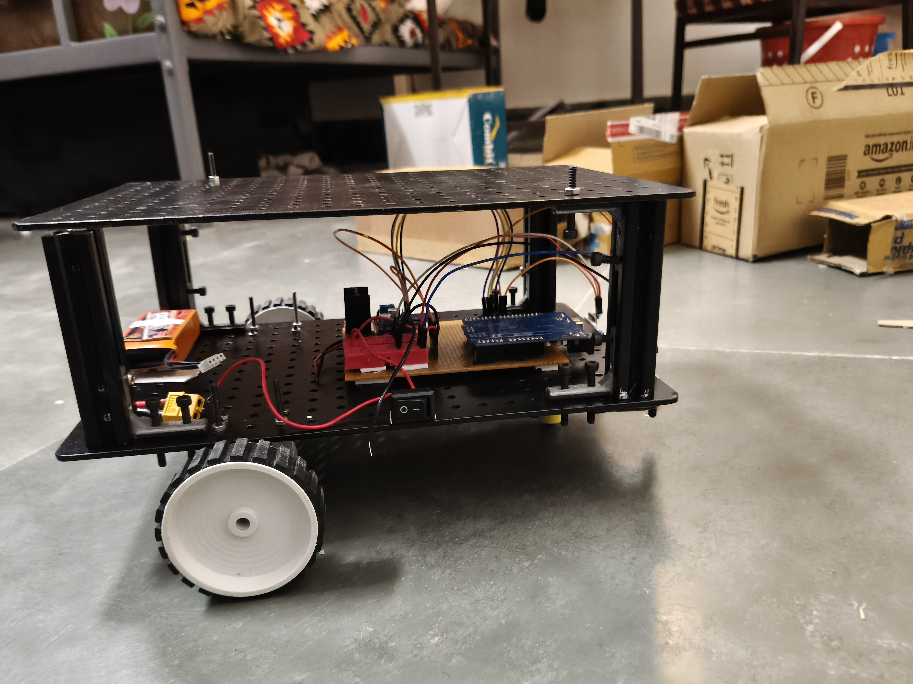
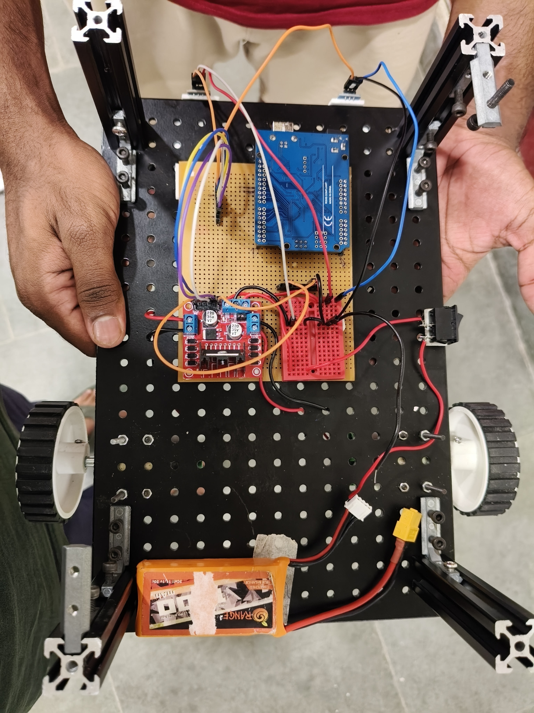

# 🚗 PID Line Follower Robot (By Using Arduino and L298N Motor Driver)

This Arduino project is a **PID-controlled Line Follower Robot** that uses three IR sensors to follow a black line on a white surface. The robot uses a basic PID control algorithm to adjust its motor speeds in real-time for smooth and accurate line tracking.

---

## 🔧 Components Required

| Component | Quantity | Purpose |
|----------|----------|---------|
| **Arduino Uno** | 1 | Microcontroller to read sensors, compute PID, and control motors |
| **L298N Motor Driver** | 1 | Drives two motors with directional and PWM control |
| **IR Sensors (TCRT5000 or similar)** | 3 | Detect black line on white surface |
| **Li-Po Battery (11.1V or 9V)** | 1 | Powers the entire system (motors and Arduino) |
| **Buck Converter (Optional)** | 1 | Steps down LiPo voltage to 5V for Arduino safely |
| **BO Motors + Wheels** | 2 | Provide mobility to the robot |
| **Caster Wheel** | 1 | Balances the robot with free rotation |
| **Robot Chassis** | 1 | Physical base to mount all components |
| **Mini Breadboard** | 1 | Quick wiring/testing of circuits |
| **PCB (optional)** | 1 | For permanent soldering & compact layout |
| **Switch (optional)** | 1  | To easily turn the robot on and off |
| **Male-to-Male, Male-to-Female, Feamle-to-Female Jumper Wires** | 20+ | Connect all modules without soldering |


---

## 📸 [Images & Video](imgAndVid)

<p float="left">
  
  
</p>

**See Video :** [VIDEO1](imgAndVid/VID1.mp4) and [VIDEO2](imgAndVid/vid2.mp4)

---

# 🧠 How Each Component Works

- **Arduino Uno:** Acts as the brain, reads IR sensor values, calculates PID, and adjusts motor speeds.

- **L298N Motor Driver:** Bridges low-power Arduino and high-current motors, enabling direction and speed control.

- **Li-Po Battery:** Supplies sufficient current for motors and Arduino. Choose 7.4V or 11.1V depending on your motor rating.

- **Buck Converter:** Converts higher battery voltage to safe 5V/9V for Arduino (if not powering via USB).

- **BO Motors + Wheels:** Convert electrical energy into motion. Used for left and right drive.

- **Caster Wheel:** Provides a third balancing point, allows smooth turning.

- **Chassis:** Holds everything together and makes the robot rigid and movable.

- **Breadboard:** For testing connections before finalizing them.

- **PCB:** Permanent version of the circuit for reliability and compactness.

- **IR Sensors:** Detect black/white contrast. Give analog or digital output depending on configuration.

- **Jumper Wires:** Connect everything without needing to solder.

---

# 🔌 Pin Configuration

| Component         | Arduino Pin |
|-------------------|-------------|
| IR Left           | A4          |
| IR Center         | A3          |
| IR Right          | A5          |
| Left Motor ENA    | 6           |
| Left Motor IN1    | 9           |
| Left Motor IN2    | 10          |
| Right Motor ENB   | 5           |
| Right Motor IN3   | 7           |
| Right Motor IN4   | 8           |

---

# ⚙️ PID Constants

```cpp
float kp = 120;
float ki = 0.0;
float kd = 70;
```

### PID Constants Explanation

- **kp** – Proportional constant. Affects how aggressively the robot reacts to errors.  
- **ki** – Integral constant. Helps eliminate accumulated small errors (often kept 0 for line following).  
- **kd** – Derivative constant. Reacts to rate of error change. Helps prevent oscillations.  

>* Note - I used 9V power supply, if you are using 12V battery then use lower value of kp and kd like (kp=70 and kd=40)

_Tune these values based on your robot’s turning behavior._

---

### 📊 How It Works

- IR sensors continuously read surface reflectivity.  
- A PID controller calculates the position error based on sensor readings.  
- Based on PID output, the motor speeds are adjusted:  
  - If the robot is veering left, speed of right motor is increased (or left decreased).  
  - If it's veering right, speed of left motor is increased.  
- This lets the robot follow the path accurately and smoothly.

---

### 💻 Code Upload Instructions

1. Connect your Arduino Uno to your PC via USB cable.  
2. Open the `.ino` file in the Arduino IDE.  
3. Go to **Tools > Board > Arduino Uno**.  
4. Go to **Tools > Port** and select the correct COM port.  
5. Click **Upload** (the ➡️ arrow icon in the IDE).  
6. (Optional) Open the Serial Monitor to see debug values from IR sensors.

---
### [Code](code.ino) Explanation
```ino
// ==================== IR Sensor Pins ====================
const int irLeft = A4;     // Left IR sensor connected to analog pin A4
const int irCenter = A3;   // Center IR sensor connected to analog pin A3
const int irRight = A5;    // Right IR sensor connected to analog pin A5

// ==================== Motor Control Pins ====================
const int leftMotorPWM = 6;     // PWM pin to control left motor speed
const int leftMotorIN1 = 9;     // IN1 for left motor direction
const int leftMotorIN2 = 10;    // IN2 for left motor direction
const int rightMotorPWM = 5;    // PWM pin to control right motor speed
const int rightMotorIN1 = 7;    // IN3 for right motor direction
const int rightMotorIN2 = 8;    // IN4 for right motor direction

// ==================== PID Constants ====================
float kp = 120;   // Proportional gain
float ki = 0.0;   // Integral gain (set to 0 for simplicity)
float kd = 70;    // Derivative gain

// ==================== PID Variables ====================
float currentError = 0;    // Real-time error based on sensor reading
float lastError = 0;       // Stores the previous error for derivative calculation
float errorSum = 0;        // Accumulates error over time (used for integral)
float errorChange = 0;     // Difference between current and last error
float pidOutput = 0;       // Final PID output used to adjust motor speed

// ==================== Motor Base Speed ====================
int defaultSpeed = 190;    // Base speed of motors (range: 0 to 255)

// ==================== IR Sensor Threshold ====================
int blackWhiteThreshold = 500;  // Analog value threshold to detect black vs white

// ==================== Arduino Setup ====================
void setup() {
  // Configure sensor pins as input
  pinMode(irLeft, INPUT);
  pinMode(irCenter, INPUT);
  pinMode(irRight, INPUT);

  // Configure motor control pins as output
  pinMode(leftMotorPWM, OUTPUT);
  pinMode(leftMotorIN1, OUTPUT);
  pinMode(leftMotorIN2, OUTPUT);
  pinMode(rightMotorPWM, OUTPUT);
  pinMode(rightMotorIN1, OUTPUT);
  pinMode(rightMotorIN2, OUTPUT);

  // Start serial communication for debugging
  Serial.begin(9600);
}

// ==================== Main Loop ====================
void loop() {
  // Read analog values from IR sensors
  int leftSensor = analogRead(irLeft);
  int centerSensor = analogRead(irCenter);
  int rightSensor = analogRead(irRight);

  // Convert analog readings into binary: 1 = black, 0 = white
  int leftDetect = (leftSensor > blackWhiteThreshold) ? 1 : 0;
  int centerDetect = (centerSensor > blackWhiteThreshold) ? 1 : 0;
  int rightDetect = (rightSensor > blackWhiteThreshold) ? 1 : 0;

  // Determine error based on sensor states
  if (leftDetect == 1 && centerDetect == 0 && rightDetect == 0) currentError = -2;
  else if (leftDetect == 1 && centerDetect == 1 && rightDetect == 0) currentError = -1;
  else if (leftDetect == 0 && centerDetect == 1 && rightDetect == 0) currentError = 0;
  else if (leftDetect == 0 && centerDetect == 1 && rightDetect == 1) currentError = 1;
  else if (leftDetect == 0 && centerDetect == 0 && rightDetect == 1) currentError = 2;
  else if (leftDetect == 1 && centerDetect == 1 && rightDetect == 1) currentError = 0; // All sensors on line
  else currentError = lastError; // If all are off line, maintain last direction

  // ========== PID Calculation ==========
  errorSum += currentError;  // For integral term (not used here as ki = 0)
  errorChange = currentError - lastError;  // For derivative term
  pidOutput = kp * currentError + ki * errorSum + kd * errorChange; // Final PID output
  lastError = currentError;  // Update last error for next loop

  // ========== Calculate Motor Speeds ==========
  int leftSpeed = defaultSpeed - pidOutput;   // Left motor slows down on turning right
  int rightSpeed = defaultSpeed + pidOutput;  // Right motor slows down on turning left

  // Limit speeds to range [0, 255]
  leftSpeed = constrain(leftSpeed, 0, 255);
  rightSpeed = constrain(rightSpeed, 0, 255);

  // Move the motors with calculated speeds
  moveMotors(leftSpeed, rightSpeed);

  delay(5);  // Small delay for stability
}

// ==================== Motor Control Function ====================
void moveMotors(int leftSpeed, int rightSpeed) {
  // Set direction of both motors (forward)
  digitalWrite(leftMotorIN1, HIGH);
  digitalWrite(leftMotorIN2, LOW);
  digitalWrite(rightMotorIN1, HIGH);
  digitalWrite(rightMotorIN2, LOW);

  // Set speed of both motors using PWM
  analogWrite(leftMotorPWM, leftSpeed);
  analogWrite(rightMotorPWM, rightSpeed);
}

```
